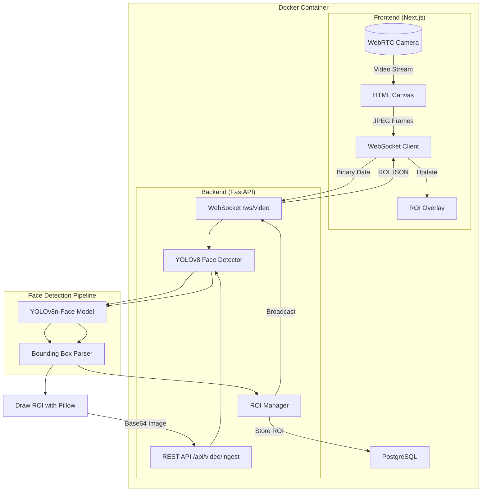
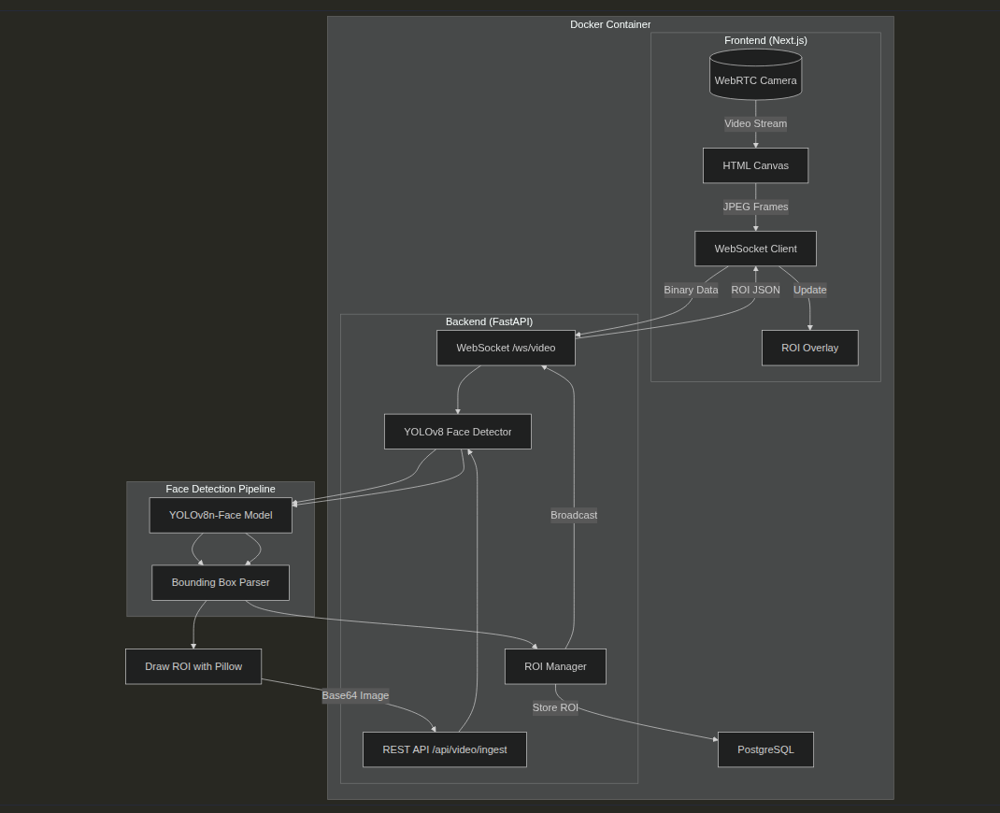

# LookLive

> Real-time face detection video streaming with YOLOv8 and WebSockets

[](https://www.python.org/)
[](https://www.typescriptlang.org/)
[](https://fastapi.tiangolo.com/)
[](https://nextjs.org/)

[Overview](#overview) · [Architecture](#architecture) · [Tech Stack](#tech-stack) · [API Reference](#api-reference) · [Environment Variables](#environment-variables) · [Local Development](#local-development)

---

## Overview

LookLive is a real-time face detection system that captures video from a webcam, runs face detection via [YOLOv8n-Face](https://github.com/breezedeus/YOLOv8-face), stores detected regions of interest (ROI) in PostgreSQL, and renders bounding box overlays in a Next.js frontend.

Key design decisions:

- **No OpenCV** — face detection uses YOLOv8; ROI drawing uses Pillow
- **Real-time WebSocket streaming** — binary frames sent over `ws://host:8000/ws/video`
- **GPU acceleration** — CUDA enabled automatically when available; falls back to CPU
- **EMA-smoothed overlays** — bounding boxes stabilize with a 0.15 exponential moving average factor

---

## Architecture





### Data Flow

**Real-Time Detection:**
1. Frontend captures video frame from webcam
2. Canvas converts frame to JPEG, sends via WebSocket
3. Backend receives frame, runs YOLOv8-face detection
4. ROI coordinates stored in PostgreSQL
5. Backend broadcasts ROI to all connected clients
6. Frontend updates overlay with smoothed coordinates

**REST API (Batch Processing):**
1. Client POSTs image to `/api/video/ingest`
2. Backend runs face detection
3. Pillow draws ROI rectangle on image
4. Returns JSON with ROI data and base64 image

---

## Tech Stack

| Layer | Technology |
|-------|------------|
| Frontend | Next.js 16, TypeScript, Tailwind CSS |
| Backend | FastAPI, Python 3.11, Uvicorn |
| Face Detection | YOLOv8n-Face (ultralytics) |
| Image Processing | Pillow (no OpenCV) |
| Database | PostgreSQL 15 |

---

## Project Structure

```
looklive/
├── backend/
│   ├── api/               # REST + WebSocket endpoints
│   ├── services/          # Face detection service
│   ├── db/               # SQLAlchemy models
│   ├── utils/            # ROI drawing utilities
│   ├── main.py           # FastAPI application entry
│   ├── pyproject.toml    # Python dependencies
│   └── Dockerfile
├── frontend/
│   ├── src/
│   │   ├── app/         # Next.js App Router pages
│   │   └── components/ # React components
│   ├── package.json
│   └── Dockerfile
├── tests/                # pytest integration + unit tests
├── docs/                 # Architecture & design docs
├── docker-compose.yml
└── DESIGN.md            # Base44 design tokens
```

---

## API Reference

Base URL: `http://localhost:8000`

### GET /health

Health check with system status.

```json
{
  "status": "healthy",
  "gpu": true,
  "model": "loaded",
  "model_name": "yolov8n-face.pt",
  "database": "connected"
}
```

### POST /api/video/ingest

Upload a single video frame for face detection. Returns the processed image with ROI drawn on it.

**Request:** `multipart/form-data` with field `file` (image)

**Response:**

```json
{
  "status": "ok",
  "roi": {"x": 100, "y": 150, "w": 200, "h": 250, "confidence": 0.95},
  "frame": "<base64-encoded image>"
}
```

### GET /api/roi

Retrieve the most recently detected ROI.

**Response:**

```json
{
  "roi": {"x": 100, "y": 150, "w": 200, "h": 250, "confidence": 0.95}
}
```

### WebSocket /ws/video

Real-time bidirectional streaming. Send JPEG frames as binary data; receive ROI coordinates.

**Client sends:** Raw binary JPEG image  
**Server sends:**

```json
{
  "roi": {"x": 100, "y": 150, "w": 200, "h": 250, "confidence": 0.95},
  "frame_id": 123
}
```

> [!NOTE]
> When no face is detected, `roi` is `null`. The frontend filters detections below confidence `0.5`.

---

## Database Schema

**Table: `roi_records`**

| Column | Type | Description |
|--------|------|-------------|
| `id` | Integer | Primary key |
| `session_id` | String | Session identifier |
| `frame_id` | Integer | Frame number within session |
| `bbox_x` | Integer | Bounding box X coordinate |
| `bbox_y` | Integer | Bounding box Y coordinate |
| `bbox_w` | Integer | Bounding box width |
| `bbox_h` | Integer | Bounding box height |
| `confidence` | Float | Detection confidence score |
| `timestamp` | DateTime | Record creation time |

**Indexes:** `session_id + frame_id` (composite), `session_id`, `timestamp`

---

## Environment Variables

| Variable | Default | Description |
|----------|---------|-------------|
| `DATABASE_URL` | `postgresql://postgres:postgres@db:5432/looklive` | PostgreSQL connection string |
| `CORS_ORIGINS` | `http://localhost:3000` | Comma-separated allowed origins |
| `NEXT_PUBLIC_WS_URL` | `ws://localhost:8000/ws/video` | WebSocket URL for frontend |

> **Note**: For production deployment, update `CORS_ORIGINS` to your production frontend URL.

---

## Face Detection Model

| Property | Value |
|----------|-------|
| Model | YOLOv8n-Face (nano) |
| Training dataset | WIDERFace |
| Accuracy | 93.79% (Easy) / 91.82% (Medium) / 79.38% (Hard) |
| Model size | 6.2 MB |
| Inference | CPU only (CUDA available for local dev) |

---

## Local Development

### With GPU Support (recommended)

**Prerequisites:** Python 3.11+, Node.js 18+, Docker (for PostgreSQL), CUDA-capable GPU

1. Start PostgreSQL:
   ```bash
   docker run -d --name looklive-db -p 5432:5432 \
     -e POSTGRES_USER=postgres \
     -e POSTGRES_PASSWORD=postgres \
     -e POSTGRES_DB=looklive \
     postgres:15-alpine
   ```

2. Start the backend (port 8000):
   ```bash
   cd backend
   python3 -m venv .venv && source .venv/bin/activate
   pip install -e .
   CORS_ORIGINS=http://localhost:3000 uvicorn main:app --reload --port 8000
   ```

3. Start the frontend (port 3000):
   ```bash
   cd frontend
   npm install
   npm run dev
   ```

### Docker Compose

```bash
docker compose up --build
```

> [!NOTE]
> GPU acceleration in Docker requires the **NVIDIA Container Toolkit** installed on the host machine.

### GPU Support in Docker

To enable GPU acceleration in Docker containers:

1. **Verify NVIDIA driver:**
   ```bash
   nvidia-smi
   ```

2. **Install NVIDIA Container Toolkit:**
   ```bash
   # Ubuntu/Debian
   distribution=$(. /etc/os-release;echo $ID$VERSION_ID)
   curl -s -L https://nvidia.github.io/nvidia-docker/gpgkey | sudo apt-key add -
   curl -s -L https://nvidia.github.io/nvidia-docker/$distribution/nvidia-docker.list | \
     sudo tee /etc/apt/sources.list.d/nvidia-docker.list
   sudo apt-get update && sudo apt-get install -y nvidia-container-toolkit
   sudo nvidia-ctk runtime configure --runtime=docker
   sudo systemctl restart docker
   ```

3. **Verify GPU access:**
   ```bash
   docker run --rm --gpus all nvidia/cuda:11.8.0-base-ubuntu22.04 nvidia-smi
   ```

Without the NVIDIA Container Toolkit, Docker falls back to CPU-only mode automatically.

**Services:**

| Service | URL |
|---------|-----|
| Frontend | http://localhost:3000 |
| Backend API | http://localhost:8000 |
| API Docs | http://localhost:8000/docs |

> [!TIP]
> Grant camera permissions when prompted by the browser. The frontend will immediately begin capturing frames and streaming them to the backend for detection.

> [!NOTE]
> On first startup, the YOLOv8n-Face model (~6.2 MB) is downloaded automatically if not present.
