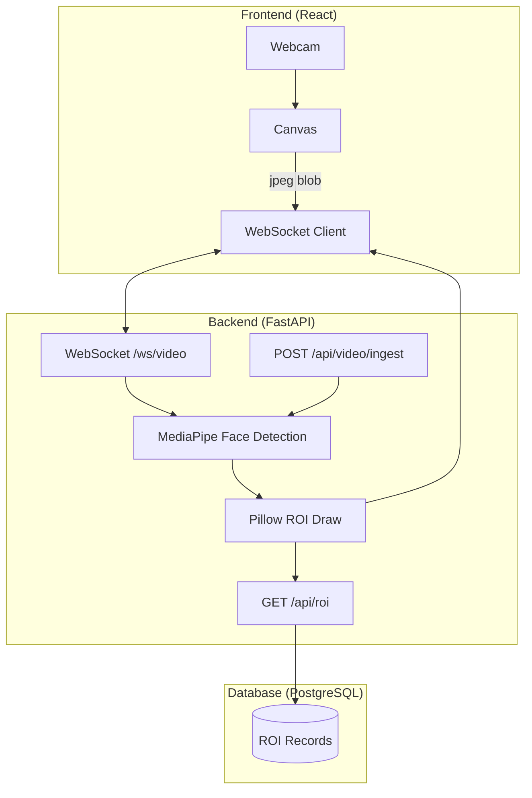

# LookLive Architecture

## Flow
1. Client webcam captures frames
2. Frames sent via WebSocket to backend
3. MediaPipe detects face (no OpenCV)
4. Pillow draws ROI rectangle (no OpenCV)
5. Processed frame returned to client
6. ROI stored in PostgreSQL